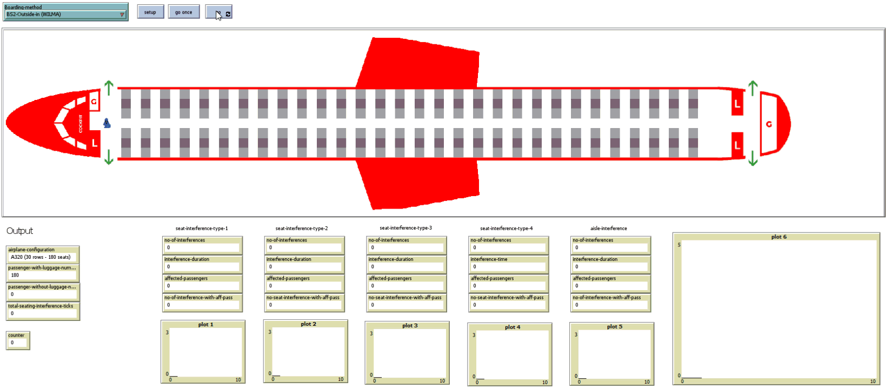
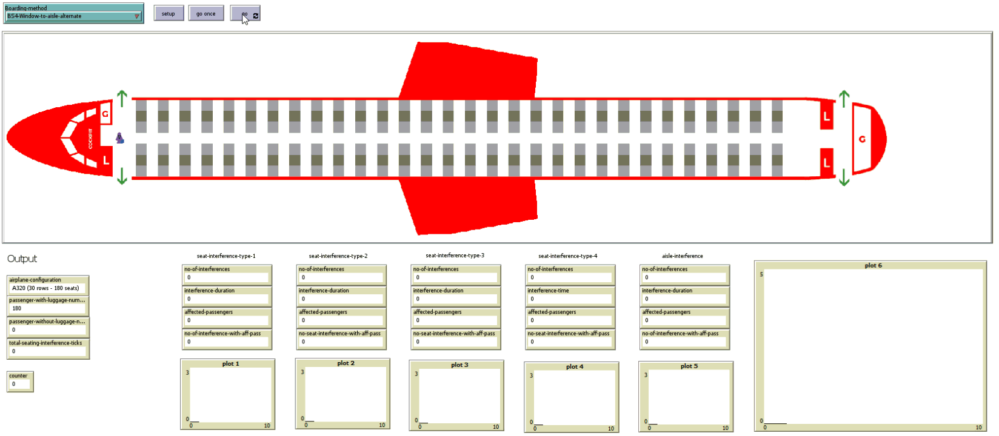

Please feel free to contact us at liviu.cotfas at ase .ro for further details regarding the paper.

# Boarding Methods

## BS1-Random-with-assigned-seats

## BS2-Outside-in (WILMA)

## BS3-Window-to-aisle-half-block

## BS4-Window-to-aisle-alternate

## BS5-Reverse-pyramid

## BS6-Reverese-pyramid-half-zone-1

## BS7-Reverese-pyramid-half-zone-2

## BS8-Back-to-front

## BS9-Back-to-front-mix

## BS10-Front-to-back

## BS11-Half-block (back-to-front)

## BS12-Half-block-mix-1

## BS13-Half-block-mix-2

## BS14-By-row-front-to-back

## BS15-By-row-back-to-front

## BS16-By-half-row-front-to-back

## BS17-By-half-row-back-to-front

## BS18-Rotating-zone

## BS19-Modified-optimal-method

## BS20-Non-traditional

## BS21-Back-to-front-by-seating-order

## BS22-By-seat-descending-order

## BS23-Steffen

## BS24-Steffen-variation

